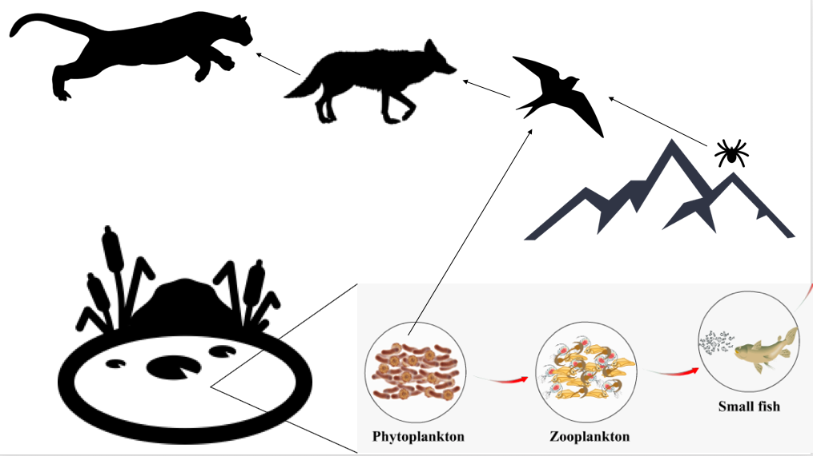

It is November 17th, 2020. You are in the Indian Peaks and have just run out of food. But COVID is still raging, Trump is still president, and avocados haven't been on sale at King Soopers for two weeks, so you are staying put. You have a fishing rod and your specialized mountain lion suffocating gear (your bare hands). You are trying to decide whether fish (from the nearby lake) or puma have lower methylmercury levels and therefore which one you should hunt to eat. 

Fortunately for you, there was some information carved into a rock near your camping spot by a scientist having an existential crises about their only mark on the world being unread journal arcticles. This information is compiled into a table to ease the strain on your weary, hungered eyes. 

# Rock info

```{r "load packages", include=FALSE}
library(tidyverse)
```

```{r}
rock_etching_info <- tibble(
  species = c("lake diatoms", "lake zooplankton", "lake fish", "terrestrial vegetation", "spiders", "birds", "coyote", "puma"),
  d_13C = c(-13,-14,-15,-29,-25,-22,-22,-23),
  d_15N = c(-0.6,3.2,5.5,-3.5,1.2,4.3,6.1,7.2)
)
rock_etching_info
```

# Mapping out potential food chain 


#Q1. How much C are birds eating from land versus lake? Save aquatic fraction as f_aq.

$$
\delta^{13}C_{bird} = f_{aq} \cdot \delta^{13}C_{aq} + (1-f_{aq})\cdot\delta^{13}C_{terr}\\
\downarrow\\
f_{aq} = \text{ equation here}\\
$$
```{r}
f_aq <- ((-22) - (-29))/((-13)-(-29))
f_aq
```


Solution: 60% of carbon eaten by birds is coming from the lake versus the land

#Q2. What trophic level are fish versus puma? 

$$
\text{Fish Trophic Position} = 1 + \frac{\delta^{15}N_{fish} - \delta^{15}N_{aq}}{\epsilon_{trophic}}\\
\space\\
\text{Puma Trophic Position} = 1 + \frac{(\delta^{15}N_{puma} - [\delta^{15}N_{aq} \cdot f_{aq}+\delta^{15}N_{terr}\cdot(1-f_{aq}) ])}{\epsilon_{trophic}}\\
\space\\
\epsilon_{trophic} = 3 
$$

```{r}
rock_etching_info # rerun to have easy access to values 

fish_troph <- 1 + ((5.5 - (-0.6))/3)
fish_troph
  
puma_troph <- 1 + ((7.2 - (-0.6*f_aq + (-3.5) * (1-f_aq)))/3) 
puma_troph
```

#Q3. Let's assume the MeHg in the lake is measured at 4.5 ng/g and that it increases 3X at each trophic level. We know all the carbon consumed by fish comes from the lake, so that is easy to calculate. For the puma, let's assume no MeHg is coming from the terrestrial environment, so we can use the f_aq value calculated above to determine the amount of MeHg getting into the birds and then multiply 3X from that concentration to get up to the puma. 

## Q3A. How much MeHg is in the fish?

```{r}
MeHg <- 4.5 
MeHg_fish <- MeHg * fish_troph
MeHg_fish
```


## Q3B. How much MeHg is in the puma? 

```{r}
MeHg_puma <- (MeHg*f_aq) * (puma_troph)
MeHg_puma
```

# Q4.

## Puma or fish? 

```{r setup, include=FALSE}
knitr::opts_chunk$set(echo = TRUE)
```

